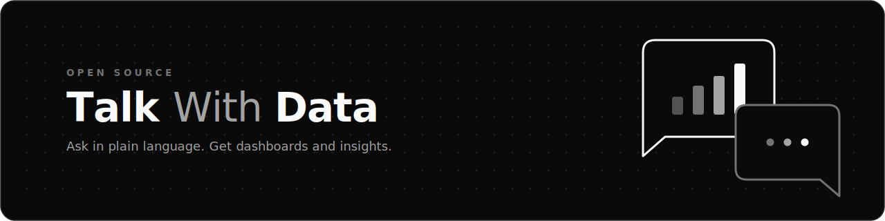

<p align="center">
  
</p>

# Talk With Data

[Read in English](README.md)

Hub open-source de dashboards com IA. Envie, organize, pesquise e incorpore dashboards, e converse com seus proprios dados por meio de fontes de dados governadas com escopo por linha.

Talk With Data ajuda equipes a publicar pacotes HTML de dashboards, pesquisar conteudo, explorar dados com IA, conectar ferramentas MCP e compartilhar visualizacoes com autenticacao ou tokens de embed. Superadmins tambem podem conectar buckets de CSV como fontes de dados governadas, para perguntas em linguagem natural com respostas sempre restritas as linhas que cada pessoa pode ver.

## Pre-requisitos

- Node.js 22 ou superior para desenvolvimento local sem Docker.
- Docker, opcional, usado no inicio rapido e recomendado para paridade com producao.
- Um banco PostgreSQL. PostgreSQL e obrigatorio, inclusive para desenvolvimento local.
- Um projeto Firebase com Authentication, Firestore e Storage habilitados.
- Um bucket no Google Cloud Storage. Uploads e assets de dashboards sao servidos via Firebase Admin Storage, entao o bucket e obrigatorio. O adaptador de storage em disco local ainda nao esta ligado ao caminho de servir arquivos.
- Pelo menos uma chave de API de um provedor de IA para os recursos de IA.

## Inicio rapido com Docker

Rode localmente com Docker em tres comandos:

```bash
cp .env.example .env
docker build -t talk-with-data -f app/Dockerfile app
docker run --rm --env-file .env -p 3000:8080 talk-with-data
```

O container escuta na porta `8080`. O parametro `-p 3000:8080` mapeia a porta para 3000 na sua maquina. Abra http://localhost:3000.

O arquivo `.env` copiado tem placeholders. Uma instancia em execucao ainda precisa de um projeto Firebase, um bucket no Google Cloud Storage, um banco PostgreSQL acessivel e pelo menos um provedor de IA. As variaveis `NEXT_PUBLIC_*` sao embutidas em tempo de build, entao uma imagem ja construida nao le esses valores do `--env-file` em runtime (veja [DEPLOYMENT.md](docs/DEPLOYMENT.md)).

## Recursos

- Fontes de dados governadas: superadmins conectam buckets de CSV no Google Cloud Storage com credenciais criptografadas por fonte, mapeamento de coluna de dono e acessos por usuario ou departamento.
- Converse com seus dados: perguntas em linguagem natural viram SQL somente leitura executado em um sandbox DuckDB em memoria sobre views filtradas por visualizador, entao cada pessoa ve apenas as linhas permitidas.
- Upload de dashboards em HTML unico ou pacotes com multiplos arquivos.
- Chat com IA para criar, editar, explicar e explorar dados.
- Busca por dashboards, categorias, donos, departamentos e pastas compartilhadas.
- APIs de dados para bases estruturadas especificas de cada dashboard.
- Integracao MCP para chamadas controladas a ferramentas externas.
- Tokens de embed para compartilhamento externo.
- Base para configuracao multi-modelo por usuario.
- Painel admin para usuarios, permissoes, categorias, departamentos, prompts, MCP, fontes de dados, armazenamento e metricas.

## Stack tecnica

- Next.js 16 com App Router.
- React 19.
- Firebase Authentication, Firestore e Firebase Storage sobre Google Cloud Storage.
- Prisma para bases estruturadas por dashboard.
- DuckDB in-process para consultas de fontes de dados.
- shadcn/ui com tema Neutral.
- Tailwind CSS 4.
- TypeScript em modo strict.
- Vitest e ESLint.

## Configuracao

Copie `.env.example` para `.env` e preencha as variaveis do seu projeto.

Variaveis principais:

- `ALLOWED_AUTH_DOMAIN`, dominio permitido para login Google.
- `NEXT_PUBLIC_ALLOWED_AUTH_DOMAIN`, copia do `ALLOWED_AUTH_DOMAIN` exposta ao navegador. Use o mesmo valor nas duas variaveis.
- `NEXT_PUBLIC_FIREBASE_*`, configuracao publica do app Firebase.
- `FIREBASE_PROJECT_ID`, projeto usado pelo Firebase Admin.
- `SA_KEY_JSON`, service account opcional para desenvolvimento local.
- `STORAGE_BUCKET_NAME`, bucket para HTML e assets dos dashboards.
- `DATABASE_URL`, string de conexao PostgreSQL usada pelo Prisma. PostgreSQL e obrigatorio, inclusive para desenvolvimento local.
- `DASHBOARD_SESSION_SECRET`, segredo para tokens de sessao e embed.
- `TWD_CREDENTIAL_ENC_KEY`, chave AES-256-GCM base64 de 32 bytes das credenciais de fontes de dados, que ficam criptografadas em repouso. Obrigatoria em producao quando uma fonte armazena credencial.
- `TWD_INSPECTION_TOKEN_SECRET`, segredo opcional dedicado aos tokens de inspecao de fontes de dados no admin. Sem ele, `DASHBOARD_SESSION_SECRET` e usado.
- `TWD_ORG_ID`, id de organizacao aplicado as fontes de dados criadas pelo admin.
- `TWD_QUERY_TIMEOUT_MS`, `TWD_MAX_ROWS` e `TWD_ENGINE_LRU_BYTES`, limites de consulta das fontes de dados (com defaults sensatos).
- `APP_URL`, URL publica da aplicacao.
- `ANTHROPIC_API_KEY`, chave para recursos de IA com Anthropic.
- `MCP_ALLOWED_HOSTS`, `MCP_API_KEY` e `MCP_URL`, configuracao opcional de MCP.
- `THUMBNAIL_FUNCTION_URL` e `THUMBNAIL_SECRET`, thumbnails opcionais.
- `STORAGE_PROVIDER` e `LOCAL_STORAGE_ROOT`, seletor de adaptador de storage. Upload e serve usam Firebase Admin Storage (GCS); o adaptador `local` existe mas ainda nao esta ligado a esses caminhos.

Veja [.env.example](.env.example) para o template completo.

## Desenvolvimento

```bash
cd app
npm install
npm run db:generate
npm run dev
```

Comandos uteis:

```bash
npm test
npm run lint
npm run build
```

## Deploy

Docker e o caminho portavel recomendado. Use `app/Dockerfile`, forneca as variaveis de ambiente e exponha a porta `8080` do container.

Consulte [DEPLOYMENT.md](docs/DEPLOYMENT.md) para Docker, Google Cloud Run, Firebase, storage, provedores de IA e MCP opcional.

## Como contribuir

Leia [CONTRIBUTING.md](CONTRIBUTING.md) antes de abrir issues ou pull requests.

Documentos de politica do projeto:

- [GOVERNANCE.md](GOVERNANCE.md), mantenedor, decisoes, triagem, depreciacao, breaking changes e gate E4.
- [SUPPORT.md](SUPPORT.md), canais publicos de suporte e pedidos fora de escopo.
- [ROADMAP.md](ROADMAP.md), trabalho comprometido para readiness de release e ideias sem compromisso.
- [SECURITY.md](SECURITY.md), reporte privado de vulnerabilidades e politica de suporte de seguranca.

## Licenca

Talk With Data usa a [licenca MIT](LICENSE).
